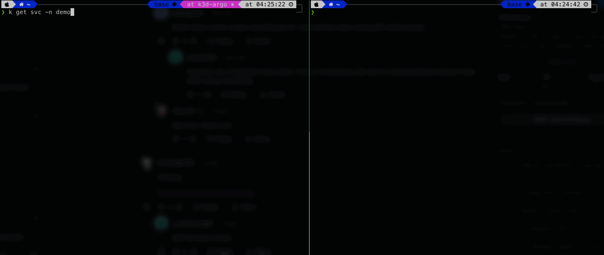
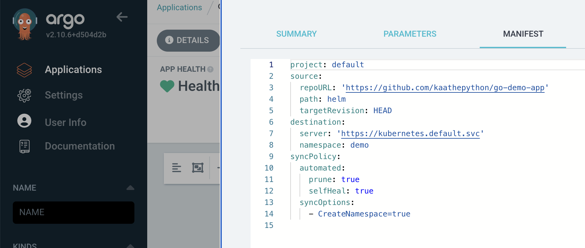

# Minimal Viable Product
### Нижче представлена демонстрація роботи програми в середовищі Kubernetes:

#### 1) Перевіряємо наявні сервіси:
```bash
$ k get svc
```
#### 2) Нас цікавить сервіс із назвою ambassador. Активуємо для нього порт 8088:
```bash
$ k port-forward -n demo svc/ambassador 8088:80&
```
#### 3) Перевіряємо відповідь порту
```bash
$ curl http://localhost:8088
```
#### 4) Підставляємо додатку наш малюнок і отримуємо бажаний результат в ascii graphics:
```bash
$ curl -F 'image=@/Users/ok/Downloads/g-logo.png' http://localhost:8088/img/
```

### Демонстрація роботи інтерфейса ArgoCD і його реакції на зміни вихідного коду


### Скріншоти налаштування застосунку на синхронізацію з репозиторієм https://github.com/kaathepython/go-demo-app та налаштованої автоматичної синхронізації

